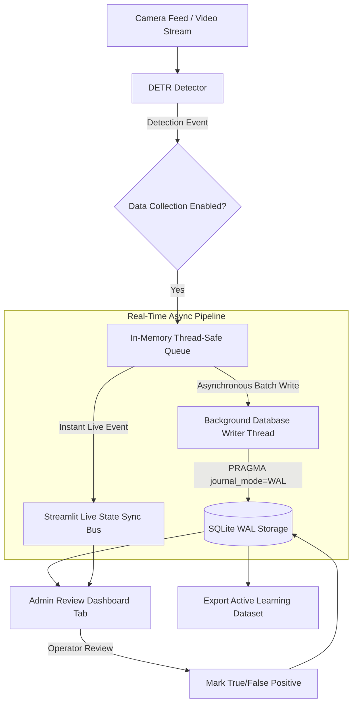

# Approach Design Document: Real-Time Detection Logging & Human-in-the-Loop Data Collection Pipeline

## 1. Executive Summary

This document outlines the architecture and implementation design for an offline-first **Real-Time Detection Logging & Data Collection Pipeline** with an integrated **Human-in-the-Loop (HITL) Admin Review Dashboard**.

### Key Objectives:
1. **Real-time Logging & Data Storage**: Capture detection metadata (timestamp, feed name, confidence score, bounding boxes, VLM verdict) and raw frame image snapshots.
2. **Confidence Categorization**:
   - **High Confidence ($\ge 0.60$)**: Logged automatically and marked as confirmed detections.
   - **Low Confidence ($< 0.60$)**: Logged and flagged with `PENDING_REVIEW` for admin verification.
3. **Admin Review Dashboard**: Dedicated dashboard tab allowing operators to inspect low-confidence candidate detections, view visual evidence, and mark them as **Accident (True Positive)** or **Not Accident (False Positive)**.
4. **Data Collection Toggle**: Global ON/OFF toggle on the dashboard to enable or disable data logging dynamically without interrupting live streaming.
5. **Continuous Active Learning Dataset**: Export human-reviewed images and annotations to facilitate future fine-tuning/retraining of the DETR/RT-DETR object detector.

---

## 2. Real-Time Database Architecture Evaluation

### Will standard SQLite cut it?
Standard SQLite can easily handle **>50,000 writes/second** on modern local NVMe/SSD drives. However, standard SQLite has two key challenges in a multi-threaded video streaming system:
1. **Database Lock Contention**: Concurrent writes from detection background threads while the Streamlit UI reads can cause `OperationalError: database is locked`.
2. **Lack of Real-Time Event Push**: SQLite is disk-based and does not natively push live event notifications to UI subscribers when a new detection is inserted.

### Database Architecture Options & Comparison

| Criteria | Option 1: SQLite (WAL Mode + Thread-Safe Queue) | Option 2: PocketBase (Single-Binary Realtime Engine) | Option 3: Redis / KeyDB (In-Memory Pub/Sub + Streams) | Option 4: Firebase Realtime DB (Cloud) |
| :--- | :--- | :--- | :--- | :--- |
| **Offline-First Support** | ✅ 100% Native | ✅ 100% Native (Single Executable) | ✅ 100% Native | ❌ Requires Internet |
| **Setup Complexity** | Zero installation (Python built-in) | Low (1 binary file) | Medium (Install Redis daemon) | Medium (API credentials) |
| **Real-time Push / Events** | Simulated via In-Memory Event Queue | ✅ Native WebSockets & Realtime Subscriptions | ✅ Native Pub/Sub & Redis Streams | ✅ Native WebSockets |
| **Write Performance** | >50,000 ops/sec (WAL mode) | >10,000 ops/sec | >100,000 ops/sec | Network Dependent |
| **Concurrency** | Non-blocking via WAL + Worker Thread | Non-blocking (Go/SQLite core) | Non-blocking | Non-blocking |

---

## 3. Recommended Hybrid Real-Time Architecture (Option 1 Enhanced)

To preserve the project's **100% offline-first, zero-external-dependency requirement** while guaranteeing high throughput and instant UI updates, we use an **In-Memory Thread-Safe Event Queue + SQLite (WAL Mode)** pattern:



### Why this Hybrid Approach Wins:
1. **Zero Lock Contention**: The background thread (`run_detection_worker`) never performs disk I/O directly. It pushes lightweight detection events into a non-blocking `queue.Queue`.
2. **Asynchronous Batching**: A dedicated `DatabaseWriterThread` drains the queue and writes records in fast SQLite WAL transactions (`PRAGMA journal_mode=WAL; PRAGMA synchronous=NORMAL;`).
3. **Instant Real-Time UI Sync**: The queue feeds live state directly into the Streamlit session state bus, giving **instant real-time UI updates** without lagging the frame rate or locking the database.

*(Note: If you prefer a full standalone WebSocket real-time server, **PocketBase** or local **Redis Streams** can be selected instead).*

---

## 4. Database Schema & Directory Structure

All data is stored locally under `data/collection/`.

```text
data/
└── collection/
    ├── detections.db           # SQLite database in WAL mode
    ├── detections.db-wal       # Write-Ahead Log file for concurrent non-blocking writes
    └── snapshots/              # Stored frame JPEG snapshot images
        ├── 20260819_163012_cam1_high.jpg
        └── 20260819_163245_cam1_low_pending.jpg
```

### Database Schema (`data/collection/detections.db`)

Table Name: `detection_logs`

| Column Name | Type | Description |
| :--- | :--- | :--- |
| `id` | INTEGER (PK) | Auto-incrementing detection record ID |
| `timestamp` | TEXT (ISO8601) | Exact date and time of detection |
| `feed_name` | TEXT | Camera feed identifier (e.g., "Camera 1 (Main)") |
| `confidence_score` | REAL | Raw confidence score from DETR detector (0.00 – 1.00) |
| `confidence_category` | TEXT | `'HIGH'` ($\ge 0.60$) or `'LOW'` ($< 0.60$) |
| `image_path` | TEXT | Relative file path to the saved JPEG snapshot image |
| `vlm_verdict` | TEXT | `'ACCIDENT'`, `'FALSE_POSITIVE'`, or `'NOT_RUN'` |
| `vlm_confidence` | REAL | Verification confidence from VLM verifier (0.00 – 1.00) |
| `review_status` | TEXT | `'AUTO_APPROVED'`, `'PENDING_REVIEW'`, `'CONFIRMED_ACCIDENT'`, `'REJECTED_FALSE_POSITIVE'` |
| `reviewer_notes` | TEXT | Optional operator feedback/comments |
| `reviewed_at` | TEXT | Timestamp when operator completed review |

---

## 5. UI & Dashboard Design Integration

### A. Sidebar / AI Settings Tab Controls
Add two controls under **🧠 AI Settings** in `ui/main.py`:
1. **Real-time Data Collection Toggle**: `st.toggle("Enable Data Collection & Logging", value=True)`
2. **Review Threshold Slider**: `st.slider("Low Confidence Review Threshold", min_value=0.10, max_value=0.90, value=0.60, step=0.05)`

### B. New Dashboard Tab: `📁 Data Collection & Review`
Add a dedicated tab in `ui/main.py`:

```text
+-----------------------------------------------------------------------------------------+
|  📁 DATA COLLECTION & HUMAN REVIEW                                                     |
+-----------------------------------------------------------------------------------------+
|  [ Total Detections: 142 ] [ Pending Review: 12 ] [ Confirmed: 110 ] [ Rejected: 20 ]  |
+-----------------------------------------------------------------------------------------+
|  Pending Review Queue (Low Confidence < 0.60)                                           |
|  +-----------------------------------+-----------------------------------------------+  |
|  | [ Image Snapshot Preview ]        | Camera: Camera 1 (Main)                       |  |
|  |                                   | Detection Score: 0.485 (LOW CONFIDENCE)       |  |
|  |                                   | Time: 2026-08-19 16:32:45                     |  |
|  |                                   | VLM Verdict: ACCIDENT (Confidence 0.85)       |  |
|  |                                   |                                               |  |
|  |                                   | [ ✅ Confirm Accident ]  [ ❌ Mark False Alarm]|  |
|  +-----------------------------------+-----------------------------------------------+  |
+-----------------------------------------------------------------------------------------+
|  [ 📥 Export Active Learning Dataset (ZIP/JSON) ]                                       |
+-----------------------------------------------------------------------------------------+
```

---

## 6. Implementation Plan & Milestones

| Step | Objective | Details |
| :--- | :--- | :--- |
| **Step 1** | Create `agentic/data_collection.py` | Implement SQLite WAL engine + in-memory Queue & worker writer. |
| **Step 2** | Integrate Data Collection Toggle | Add UI toggle switch in `ui/main.py` sidebar and wire up snapshot saving logic in `ui/utils.py`. |
| **Step 3** | Build Admin Review Dashboard | Create `📁 Data Collection & Review` tab in `ui/main.py` with snapshot viewer, metrics, and action buttons. |
| **Step 4** | Build Dataset Exporter | Implement single-click export function generating a structured dataset folder/ZIP for retraining. |
| **Step 5** | Testing & Validation | Test streaming with data collection enabled/disabled, verify SQLite database population, and test HITL review workflow. |

---

## 7. Open Questions & User Feedback

1. **Architecture Preference**: Do you prefer the **SQLite (WAL Mode + Thread-Safe Event Queue)** approach (zero extra setup, 100% offline), or would you prefer a standalone server like **PocketBase** or **Redis**?
2. **Snapshot Storage**: Should image snapshots save the full camera frame, a cropped region around the accident, or both?

> [!NOTE]
> Please review this updated approach design document. Upon your approval, we will proceed with implementation.
