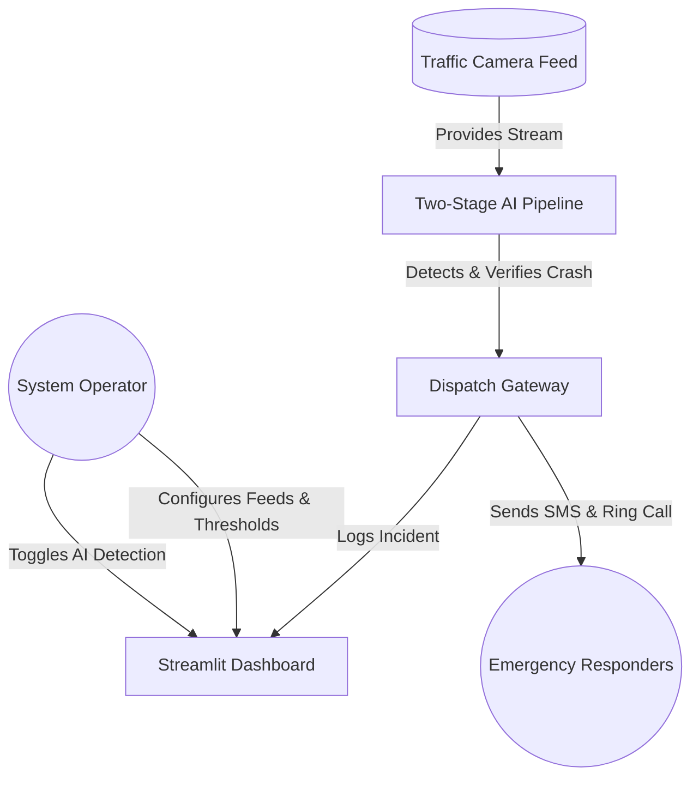
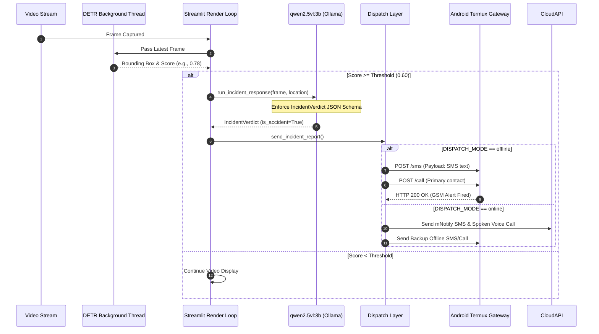
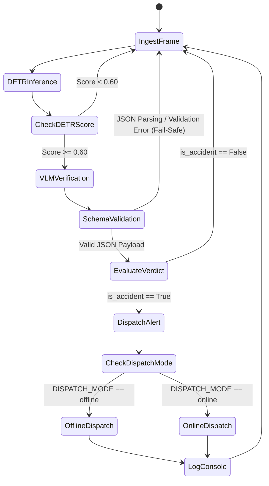

# AI-Driven Road Accident Detection, Verification and Emergency Alert System

**PROJECT DOCUMENTATION FOR CONSIDERATION UNDER BACHELOR OF SCIENCE (BSc) COMPUTER SCIENCE PROGRAMME**

**Department of Computer Science**  
**Kwame Nkrumah University of Science and Technology (KNUST), Kumasi, Ghana**  
**Target Stakeholder / Deployment Pilot:** Kumasi Metropolitan Assembly (KMA)  

---

### **Submitted by:**
- **ABDUL HAQUE YAHAYA YELPOEA** – 3359522 / 20958508  
- **SAADATU IBRAHIM** – 3393722  

### **Supervised by:**
- **Dr. (Mr.) OLIVER KORNYOR** (Senior Lecturer, Department of Computer Science)

---

## DECLARATION

We declare without any reservation that we personally undertook this project on the KNUST campus, herein submitted under supervision towards the award of the Bachelor of Science (BSc) degree in Computer Science. To the best of our knowledge, it contains no material previously published or written by another person, nor material which to a substantial extent has been accepted for the award of any other degree of the University or any other institute of higher learning.

\
**Signed:** ___________________________          **Date:** ___________________  
**MR. ABDUL HAQUE YAHAYA YELPOEA**  
(Index No. 3359522 / 20958508)

\
**Signed:** ___________________________          **Date:** ___________________  
**MISS SAADATU IBRAHIM**  
(Index No. 3393722)

\
**DECLARATION BY SUPERVISOR**  
I declare that I have personally supervised these students in undertaking the study report herein and I confirm that these students have my permission to present it for assessment.

\
**Signed:** ___________________________          **Date:** ___________________  
**DR. (MR.) OLIVER KORNYOR**  
(Supervisor, Department of Computer Science)

---

## ACKNOWLEDGEMENT

We would first and foremost like to express our deepest gratitude to God Almighty for His unending grace, wisdom, and protection, which enabled us to complete this work. 

We are sincerely grateful to our supervisor, **Dr. Oliver Kornyor**, Senior Lecturer in the Department of Computer Science at Kwame Nkrumah University of Science and Technology (KNUST), for his immense support, academic leadership, and continuous encouragement throughout this project. We also acknowledge his Teaching Assistants for their critical feedback during project reviews, which highlighted the necessity of explicit, selectable launch modes (online vs. offline) for edge deployment.

We extend our profound appreciation to the officials of the **Kumasi Metropolitan Assembly (KMA)** for participating in our system demonstration and engaging in constructive discussions regarding pilot deployment on high-incident traffic corridors in Kumasi. 

Finally, we extend our heartfelt thanks to our parents, family members, and friends whose financial and emotional support sustained us throughout our undergraduate studies.

---

## DEDICATION

We dedicate this dissertation work to the memory of victims of road traffic collisions in Ghana and across developing nations, and to the emergency first responders who work tirelessly under resource-constrained conditions. May automated artificial intelligence and edge technology serve to protect lives, accelerate emergency dispatch, and eliminate the preventable loss of life on our roads.

---

## TABLE OF CONTENTS

- [TABLE OF FIGURES](#table-of-figures)
- [TABLE OF TABLES](#table-of-tables)
- [CHAPTER 1: INTRODUCTION](#chapter-1-introduction)
  - [1.1 Introduction](#11-introduction)
  - [1.2 Problem Statement](#12-problem-statement)
  - [1.3 Project Aim](#13-project-aim)
  - [1.4 Specific Objectives](#14-specific-objectives)
  - [1.5 Project Justification](#15-project-justification)
  - [1.6 Project Motivation](#16-project-motivation)
  - [1.7 Project Scope](#17-project-scope)
  - [1.8 Project Timeline & Milestones](#18-project-timeline--milestones)
- [CHAPTER 2: LITERATURE REVIEW & SYSTEM ANALYSIS](#chapter-2-literature-review--system-analysis)
  - [2.1 Review of Similar Systems](#21-review-of-similar-systems)
  - [2.2 Processes of the Existing Manual System](#22-processes-of-the-existing-manual-system)
  - [2.3 Pros and Cons of Existing Related Systems](#23-pros-and-cons-of-existing-related-systems)
  - [2.4 Problem Identification](#24-problem-identification)
  - [2.5 Project Feasibility Evaluation](#25-project-feasibility-evaluation)
  - [2.6 Review of Related Methodologies](#26-review-of-related-methodologies)
  - [2.7 The Proposed System Architecture](#27-the-proposed-system-architecture)
  - [2.8 Conceptual Design](#28-conceptual-design)
  - [2.9 System Architecture & Layer Breakdown](#29-system-architecture--layer-breakdown)
  - [2.10 Component Designs and Description](#210-component-designs-and-description)
  - [2.11 Development Tools and Environment](#211-development-tools-and-environment)
  - [2.12 Benefits of Implementation](#212-benefits-of-implementation)
- [CHAPTER 3: REQUIREMENTS SPECIFICATIONS](#chapter-3-requirements-specifications)
  - [3.1 Requirement Gathering](#31-requirement-gathering)
  - [3.2 Functional Requirements](#32-functional-requirements)
  - [3.3 Non-Functional Requirements](#33-non-functional-requirements)
  - [3.4 UML Diagrams & Workflow Modeling](#34-uml-diagrams--workflow-modeling)
  - [3.5 Logical Design Considerations & Schema Guardrails](#35-logical-design-considerations--schema-guardrails)
- [CHAPTER 4: IMPLEMENTATION AND RESULTS](#chapter-4-implementation-and-results)
  - [4.1 Overview](#41-overview)
  - [4.2 Mapping Logical Design onto Physical Platform](#42-mapping-logical-design-onto-physical-platform)
  - [4.3 Modular System Construction](#43-modular-system-construction)
  - [4.4 Empirical Testing & Results](#44-empirical-testing--results)
- [CHAPTER 5: FINDINGS AND CONCLUSION](#chapter-5-findings-and-conclusion)
  - [5.0 Overview](#50-overview)
  - [5.1 Summary of Main Findings](#51-summary-of-main-findings)
  - [5.2 Comparison with Initial Aim](#52-comparison-with-initial-aim)
  - [5.3 Main Contributions](#53-main-contributions)
  - [5.4 System Limitations](#54-system-limitations)
  - [5.5 Suggestions for Future Research and Development](#55-suggestions-for-future-research-and-development)
- [REFERENCES](#references)

---

## TABLE OF FIGURES

| Figure ID | Caption / Description | Reference Section |
|---|---|---|
| **Figure 1** | Manual bystander-dependent accident reporting workflow diagram | Section 2.2 |
| **Figure 2** | AI-assisted automated accident detection and emergency dispatch process | Section 2.7 |
| **Figure 3** | Two-stage candidate detection and visual verification conceptual gate | Section 2.8 |
| **Figure 4** | Overview of proposed 3-layer system architecture (Presentation, Intelligence, Dispatch) | Section 2.9 |
| **Figure 5** | Use Case Diagram — Operator, CCTV Feed, AI Pipeline, and Emergency Responders | Section 3.4 |
| **Figure 6** | Activity Diagram — Two-stage decision gate and fail-safe validation flow | Section 3.4 |
| **Figure 7** | Sequence Diagram — Video Stream → DETR Detection → VLM Verification → Dual-Mode Dispatch | Section 3.4 |
| **Figure 8** | Compute & Physical Hardware Mapping (Laptop Host, Ollama Server, Android Termux Gateway) | Section 4.2 |
| **Figure 9** | Live Operator Dashboard (`ui/main_v2.py`) — Real-time Video Stream with Bounding Box Overlay | Section 4.3 |
| **Figure 10** | Live Operator Dashboard — AI Settings Control Panel (Confidence Threshold Slider & Mode Toggle) | Section 4.3 |
| **Figure 11** | Streamlit Audit Console showing confirmed incident logs and verification details | Section 4.3 |
| **Figure 12** | Termux HTTP SMS & Telephony Gateway (`termux_gateway/sms_server.py`) running on Android handset | Section 4.3 |
| **Figure 13** | Local Ollama Model Server hosting `qwen2.5vl:3b` (terminal output) | Section 4.3 |
| **Figure 14** | Code Snapshot — Pydantic `IncidentVerdict` Schema (`agentic/agents.py`) | Section 3.5 |
| **Figure 15** | Code Snapshot — Decoupled Async DETR Background Inference Thread (`ui/main_v2.py`) | Section 4.3 |
| **Figure 16** | Precision, Recall, and Accuracy Benchmark Plot (Single-Stage DETR vs. Hybrid Pipeline) | Section 4.4 |
| **Figure 17** | Kumasi Metropolitan Assembly (KMA) Stakeholder System Demonstration | Section 1.5 |

---

## TABLE OF TABLES

| Table ID | Title / Content Summary | Reference Section |
|---|---|---|
| **Table 1** | Development Tools, Libraries, and Environment Specifications | Section 2.11 |
| **Table 2** | System Functional Requirements (FR-1 to FR-9) | Section 3.2 |
| **Table 3** | Benchmark Comparison: DETR-only vs. Hybrid Pipeline @ 0.85 Threshold | Section 4.4 |
| **Table 4** | Benchmark Comparison: DETR-only vs. Hybrid Pipeline @ 0.60 Threshold (Adopted) | Section 4.4 |
| **Table 5** | VLM Benchmarks (Cloud Gemini 2.5 Flash vs. Local `qwen2.5vl:3b` vs. `gemma4:e2b`) | Section 4.4 |
| **Table 6** | Three-Way Local Offline Model Benchmarks (`qwen2.5vl:3b` vs. `gemma4:e2b` vs. `qwen3-vl:4b`) | Section 4.4 |
| **Table 7** | Project Timeline and Chronology of Key Milestones | Section 1.8 |
| **Table 8** | Hand-Labelled Calibration Dataset Composition (54 Video Frames) | Section 4.4 |

---

## CHAPTER 1: INTRODUCTION

### 1.1 Introduction
Road traffic collisions present a severe public safety crisis globally, with a disproportionately heavy burden falling on low- and middle-income countries. In developing nations such as Ghana, emergency medical response times are frequently delayed due to systemic gaps in incident awareness. When a vehicle collision occurs, emergency dispatch services rely almost exclusively on human bystanders to notice the crash, identify the location, and place a phone call to emergency hotlines. In non-urban corridors, during nighttime hours, or on sparsely populated stretches of highway, accidents frequently go unreported for critical minutes or hours—a phenomenon often referred to as the "golden hour" delay, during which mortality rates increase drastically.

With the proliferation of municipal closed-circuit television (CCTV) cameras and traffic monitoring infrastructure, automated computer vision offers a transformative alternative. However, traditional automated monitoring systems heavily depend on persistent high-speed internet connectivity, expensive cloud computational servers, and human operators continuously viewing monitor walls.

This project presents an **AI-Driven Road Accident Detection, Verification and Emergency Alert System** designed specifically to solve these real-world constraints. The system continuously ingests traffic video streams, processes visual feeds using an ultra-fast computer vision detector, verifies candidate incidents using a vision-language model, and automatically dispatches multi-channel alerts (SMS text messages and telephone calls) to emergency personnel without requiring human intervention. Crucially, the entire intelligence and dispatch pipeline is engineered to operate **100% offline**, relying on locally hosted open-weights models and edge cellular gateway hardware.

### 1.2 Problem Statement
The deployment of automated traffic monitoring in developing regions faces three critical technical and operational barriers:

1. **Unreported Incident Latency:** Accidents occurring in remote or unmonitored zones go undetected until passing motorists notice them, depriving victims of immediate medical triage.
2. **High False Alarm Rates in Single-Stage Computer Vision:** Existing single-stage object detection models (such as YOLO or standard CNNs) exhibit extreme sensitivity trade-offs. When tuned strictly to avoid false positives, they miss subtle collisions (low recall). When tuned loosely to capture faint collisions, they repeatedly trigger false alarms on normal traffic events like heavy congestion, vehicle shadows, glare, or double-parked delivery vans (low precision). In an automated dispatch setting, repeated false alarms waste scarce municipal emergency resources and erode responder trust in automated notifications.
3. **Cloud & Connectivity Dependency:** Commercial state-of-the-art visual inspection platforms rely on cloud APIs (e.g., OpenAI, Google Cloud Vision). In many deployment contexts across Sub-Saharan Africa, cellular data connectivity at camera pole locations is either non-existent, prohibitively expensive, or highly unreliable during bad weather or power outages. Systems that fail when offline are unusable for critical infrastructure monitoring.

### 1.3 Project Aim
The central aim of this project is to design, construct, benchmark, and evaluate a fully offline-capable, two-stage artificial intelligence system that automatically detects road traffic collisions from video feeds and dispatches localized emergency alerts (SMS and voice calls) to responders with **zero reliance on cloud infrastructure or active internet connections**.

### 1.4 Specific Objectives
To achieve the primary aim, the project fulfilled the following six technical objectives:

1. **Real-time Video Ingestion & Object Detection:** Implement an always-on, fast computer vision pipeline using a DEtection TRansformer (DETR) model to scan video feeds continuously and identify potential collision scenes.
2. **Two-Stage Verification Pipeline:** Design a second-stage verification gate leveraging a locally hosted Vision-Language Model (VLM)—specifically `qwen2.5vl:3b` via Ollama—to inspect candidate frames flagged by DETR, confirming genuine accidents while filtering out false positives through visual reasoning.
3. **Multi-Channel Emergency Alert Dispatch:** Develop automated dispatch capabilities capable of sending structured SMS text reports and placing automated telephone calls to emergency contacts upon incident confirmation.
4. **Dual-Mode Architecture (Offline-First Engineering):** Engineer explicit launch modes (`runner_offline.sh` vs. `runner_online.sh`) enabling the complete pipeline—ingestion, detection, verification, and dispatch—to run completely offline via a local Android Termux cellular gateway over local Wi-Fi hotspots, alongside an optional online cloud API mode.
5. **Rigorous Empirical Evaluation:** Assemble a hand-labelled, multi-condition test dataset of 54 video frames (24 positive accidents, 30 negative normal traffic) to empirically evaluate precision, recall, accuracy, and latency across baseline single-stage and proposed hybrid architectures.
6. **Operator Monitoring Interface:** Construct an intuitive, high-performance Streamlit monitoring dashboard enabling operators to control multi-camera feeds, adjust detection thresholds dynamically, observe real-time bounding box overlays, and inspect an incident audit log.

### 1.5 Project Justification
This research is directly grounded in real-world stakeholder needs rather than theoretical abstraction. During the development phase, a demonstration of the system was presented to members of the **Kumasi Metropolitan Assembly (KMA)** in Ghana. The assembly expressed strong interest in piloting the software across high-density, accident-prone intersections within Kumasi.

> **[IMAGE PLACEHOLDER: Figure 17 - Kumasi Metropolitan Assembly (KMA) Stakeholder System Demonstration]**  
> *Description: Photograph or presentation record showing the demonstration session with Kumasi Metropolitan Assembly officials, reviewing the AI traffic incident alert system.*

Furthermore, cloud-based monitoring architectures incur recurring data transfer costs and server subscription fees that municipal budgets in low-resource settings cannot sustain. By proving that open-weight vision-language models running on consumer-grade laptop hardware (with an Android phone acting as an SMS gateway) can achieve high precision in accident verification, this project provides a low-cost, sustainable blueprint for smart city traffic safety in developing countries.

### 1.6 Project Motivation
As undergraduate researchers at Kwame Nkrumah University of Science and Technology (KNUST) in Kumasi, Ghana, we observe firsthand the challenges of emergency services navigating dense urban traffic and poorly lit arterial roads. The motivation behind this work stems from a commitment to leveraging modern artificial intelligence—specifically small, efficient, open-weights vision-language models—to solve local public safety challenges. Building an offline-first system ensures that local infrastructural limitations do not prevent communities from benefiting from state-of-the-art computational safety tools.

### 1.7 Project Scope

#### In-Scope Features (Built and Validated):
- Continuous video ingestion from webcam feeds, local MP4/RTSP video files, and mock streams.
- Real-time candidate detection using DETR (`hilmantm/detr-traffic-accident-detection`).
- Secondary visual verification using `qwen2.5vl:3b` hosted locally via Ollama with Pydantic JSON schema enforcement (`agentic/agents.py`).
- Fully offline SMS alert dispatch via an Android handset running Termux and `termux_gateway/sms_server.py`.
- Fully offline attention-getting ring calls placed through the Android GSM SIM slot.
- Online SMS and spoken text-to-speech voice call dispatch via the mNotify gateway API.
- Live Streamlit operator dashboard (`ui/main_v2.py`) with decoupled background inference threads.
- Comprehensive empirical evaluation benchmark script (`agentic/benchmark_detr_hybrid.py`) and dataset.

#### Out-of-Scope / Deferred Features (Explicitly Documented):
- **Fully Offline Spoken Text-to-Speech Calls:** While audio synthesis is generated locally via `pocket-tts`, delivering synthesized spoken audio over a native offline cellular GSM call without internet gateway bridges remains an open engineering challenge. Offline mode currently delivers SMS plus an attention-getting ring call.
- **Model Fine-Tuning (SFT):** Supervised fine-tuning of Qwen2.5-VL on localized Ghanaian traffic collision datasets was identified as future work.
- **Enterprise Security & Authentication:** Multi-tenant user authentication, end-to-end database encryption, and hardware multi-camera clustering were deferred to production-grade deployment phases.

### 1.8 Project Timeline & Milestones
The development of this project followed an intensive research and implementation schedule. The commit log and milestone progression are summarized in Table 7.

**Table 7: Project Timeline and Chronology of Key Milestones**

| Milestone Date | Milestone Description | Primary Deliverable / Component |
|---|---|---|
| **2026-06-24** | Project Inception & Base Simulation Setup | Pygame traffic intersection baseline testbed |
| **2026-07-04** | Core Vision Pipeline Functional | DETR object detection integration on video feeds |
| **2026-07-06** | Hardware Acceleration & Threading | Decoupled background DETR worker thread; PyTorch GPU (NVIDIA MX250 CUDA cu126) support |
| **2026-07-08** | Offline Gateway & Initial Model Benchmarking | Android Termux HTTP SMS gateway (`sms_server.py`); initial LLM verifier evaluation (`gemma4:e2b`) |
| **2026-07-11** | Architecture Migration: Structured JSON Output | Replaced LangGraph ReAct tool-calling with Pydantic JSON Schema decoding (`IncidentVerdict`) |
| **2026-07-20** | Dataset Expansion & Benchmark Optimization | Expanded dataset to 54 frames; integrated `qwen2.5vl:3b`; added offline ring call; lowered DETR threshold to 0.60 |
| **2026-07-22** | Dual Launcher Scripts & UI Polish | Added explicit launch modes (`runner_offline.sh` / `runner_online.sh`); UI dashboard redesign (`ui/main_v2.py`) |
| **2026-08-13** | Dissertation Documentation & Stakeholder Package | Finalized complete documentation (`complete_docs.md` & `.docx.md`) and KMA pilot presentation materials |

---

## CHAPTER 2: LITERATURE REVIEW & SYSTEM ANALYSIS

### 2.1 Review of Similar Systems
Automated accident detection systems in contemporary research generally fall into three categories:

1. **Sensor-Based On-Board Units (OBUs):** Vehicle-mounted telematics systems utilize accelerometers, gyroscopes, and GPS receivers to detect sudden decelerations indicative of collisions. While fast, these systems require widespread hardware installation across all civilian vehicles—an economically unviable requirement for low-income regions.
2. **Acoustic & Vibration Sensors:** Roadside microphones tuned to detect glass breaking, metal crumpling, or tire screeches. These systems suffer from high ambient noise interference (e.g., thunder, construction) and cannot provide visual context to dispatchers.
3. **Cloud-Connected CCTV Video Analytics:** Modern smart-city platforms deploy Convolutional Neural Networks (CNNs) or YOLO variants on traffic cameras. However, standard commercial implementations (e.g., AWS Panorama, Google Cloud Video Intelligence) transmit raw high-definition video over cellular networks to central cloud servers, incurring massive bandwidth overhead and failing entirely during internet outages.

### 2.2 Processes of the Existing Manual System
In the current manual emergency dispatch workflow in Ghana:
1. An accident occurs at an intersection or highway stretch.
2. The incident remains unknown to authorities until a passing motorist or pedestrian notices it.
3. The bystander dials an emergency hotline (e.g., 112 or local police/ambulance numbers).
4. The caller verbally describes the location and severity to a central operator.
5. The operator manually dispatches the nearest emergency service unit.

*Failure Points:* If no bystander is present, if bystander phones lack airtime/credit, or if network congestion occurs, dispatch is delayed indefinitely.

> **[IMAGE PLACEHOLDER: Figure 1 - Manual Bystander-Dependent Accident Reporting Workflow Diagram]**  
> *Description: Diagram illustrating the current manual accident reporting process, highlighting human delays, bystander absence risks, and communication bottlenecks.*

### 2.3 Pros and Cons of Existing Related Systems

#### Traditional Cloud Vision Systems:
- **Pros:** High computational capacity; centralized management; easy integration with enterprise web portals.
- **Cons:** Complete vulnerability to internet failure; recurring cloud API billing; high bandwidth consumption; high false positive rates in single-stage models.

#### Proposed Offline Hybrid System:
- **Pros:** Zero cloud data costs; 100% operation during internet blackouts; dramatically reduced false alarms via VLM visual reasoning; low-cost edge deployment.
- **Cons:** High local inference latency per frame compared to simple CNNs (~55s total pipeline turn-around); requires localized edge hardware setup.

### 2.4 Problem Identification
The critical system gap identified is the **absence of an autonomous, low-cost, offline-first visual monitoring framework that combines fast candidate filtering with deep visual verification**. Single-stage detectors cannot be trusted to dispatch emergency services autonomously due to false alarms, while cloud VLMs cannot be deployed reliably in bandwidth-constrained environments.

### 2.5 Project Feasibility Evaluation
- **Technical Feasibility:** Fully demonstrated. The combination of lightweight object detectors (DETR) and compressed vision-language models (`qwen2.5vl:3b`) runs successfully on standard laptop processors and low-end mobile GPUs (NVIDIA GeForce MX250), utilizing PyTorch CUDA acceleration.
- **Economic Feasibility:** Highly favorable. The system utilizes open-weight models, open-source frameworks (Streamlit, Ollama, LangChain), and re-purposes inexpensive Android smartphones as local SMS gateways, eliminating expensive cloud infrastructure requirements.
- **Operational Feasibility:** Validated through direct stakeholder interaction with the Kumasi Metropolitan Assembly (KMA). Operators require minimal training, as the interface provides automated alerting with simple threshold sliders.

### 2.6 Review of Related Methodologies
This project was executed using an **Iterative Agile / Empirical Development Methodology**. Rather than adhering to a rigid waterfall plan, each development cycle consisted of implementing a functional pipeline feature, measuring performance against empirical calibration sets, identifying failure modes, and refining the architecture. For example, when early testing revealed that tool-calling in small LLMs caused unreliability, the architecture was refactored into strict Pydantic JSON Schema decoding, yielding immediate accuracy improvements.

### 2.7 The Proposed System Architecture
The proposed system implements a **Two-Stage Artificial Intelligence Gate** coupled with a **Dual-Mode Dispatch Gateway**:

```
 ┌─────────────────────────────────────────────────────────┐
 │                   Video Source Ingestion                 │
 │             (Live Camera / RTSP / MP4 File)             │
 └────────────────────────────┬────────────────────────────┘
                              │
                              ▼
 ┌─────────────────────────────────────────────────────────┐
 │           STAGE 1: Always-On Fast Detector              │
 │      DETR Object Detector (hilmantm/detr-traffic)       │
 │            Runs continuously on every frame             │
 └────────────────────────────┬────────────────────────────┘
                              │ Candidate Frame Flagged
                              │ (Confidence ≥ 0.60)
                              ▼
 ┌─────────────────────────────────────────────────────────┐
 │         STAGE 2: Careful Local Visual Verifier          │
 │       qwen2.5vl:3b VLM (Hosted locally via Ollama)      │
 │     Evaluates scene context & visual collision cues     │
 └────────────────────────────┬────────────────────────────┘
                              │
                              ├─────────────────────────────┐
                              │ Verdict: is_accident = True │ Verdict: False Positive
                              ▼                             ▼
 ┌─────────────────────────────────────────────────────────┐ ┌──────────────────┐
 │               DUAL-MODE DISPATCH LAYER                  │ │ Log & Suppress   │
 │   ┌─────────────────────────┬───────────────────────┐   │ │   (No Alert)     │
 │   │  OFFLINE MODE           │  ONLINE MODE          │   │ └──────────────────┘
 │   │  • Termux Gateway SMS   │  • mNotify Cloud SMS  │   │
 │   │  • Termux GSM Ring Call │  • mNotify Voice Call │   │
 │   │  • Zero Internet        │  • Offline Termux Red.│   │
 │   └─────────────────────────┴───────────────────────┘   │
 └─────────────────────────────────────────────────────────┘
```

> **[IMAGE PLACEHOLDER: Figure 2 - AI-Assisted Automated Accident Detection and Emergency Dispatch Process Diagram]**  
> *Description: Process flow diagram illustrating automated video stream ingestion, candidate screening, secondary visual verification, and automated alert dispatch.*

### 2.8 Conceptual Design
The core conceptual innovation is the separation of **detection frequency** from **verification depth**:
- **Stage 1 (DETR)** operates with high recall and low latency (~0.4s/frame on GPU), rapidly screening high-volume video frames.
- **Stage 2 (`qwen2.5vl:3b`)** operates with high precision and higher latency (~90s per verification call), executing visual reasoning only on suspicious frames. This guarantees that deep visual inspection is reserved exclusively for candidate events.

> **[IMAGE PLACEHOLDER: Figure 3 - Two-Stage Candidate Detection and Visual Verification Conceptual Gate Diagram]**  
> *Description: Conceptual diagram showing the decision filtering mechanism between Stage 1 DETR candidate screening and Stage 2 VLM visual verification.*

### 2.9 System Architecture & Layer Breakdown
The software is structured into a clean **Three-Layer Architecture**:

1. **Presentation Layer (Dashboard UI):** Implemented in Streamlit (`ui/main_v2.py`). Renders live video feeds, overlays real-time detection bounding boxes, exposes control widgets (AI toggles, threshold sliders), and displays the real-time incident audit log.
2. **Intelligence Layer (Computer Vision & VLM Reasoning):** 
   - *Detector Worker:* Asynchronous background thread executing HuggingFace `transformers` DETR pipeline.
   - *Verifier Engine:* Ollama-hosted `qwen2.5vl:3b` executing Pydantic JSON Schema decoding (`agentic/agents.py`).
3. **Dispatch & Gateway Layer (Alert Infrastructure):** Managed by `agentic/tools.py` and `agentic/utils.py`. Reads the global `DISPATCH_MODE` environment variable (`online` vs. `offline`) and routes alerts to cloud HTTP APIs or the local Android Termux HTTP server (`termux_gateway/sms_server.py`).

> **[IMAGE PLACEHOLDER: Figure 4 - Overview of Proposed 3-Layer System Architecture Diagram]**  
> *Description: Block diagram detailing the 3-layer system design (Presentation Layer, Intelligence Layer, and Dispatch Gateway Layer).*

### 2.10 Component Designs and Description

#### Data Flow Sequence:
1. Video frame captured via OpenCV `cv2.VideoCapture`.
2. Frame passed to decoupled background DETR thread (non-blocking display loop).
3. If DETR detects an `accident` class with confidence $\ge 0.60$, the frame is passed to `run_incident_response()`.
4. `qwen2.5vl:3b` processes the visual array and returns a JSON payload satisfying `IncidentVerdict`.
5. If `is_accident == True`, dispatch logic triggers multi-channel alerts based on `DISPATCH_MODE`.

### 2.11 Development Tools and Environment
The system dependencies and development environment are detailed in Table 1.

**Table 1: Development Tools, Libraries, and Environment Specifications**

| Category | Component / Tool Name | Specific Version / Configuration | Role in System |
|---|---|---|---|
| **Language & Runtime** | Python | `v3.13+` | Core application language |
| **Package Management** | `uv` (Astral) | `v0.4+` | Fast, deterministic dependency lock management |
| **Dashboard UI** | Streamlit | `v1.58.0` | Reactive web interface and render loop |
| **Object Detection** | DETR (`hilmantm/detr-traffic...`) | HuggingFace `transformers v5.12.0` | Stage 1 continuous candidate frame detector |
| **Deep Learning Framework** | PyTorch / Torchvision | `v2.12.0` (CUDA `cu126` wheels) | Tensor computations and GPU acceleration |
| **Vision-Language Model** | `qwen2.5vl:3b` | Hosted via Ollama `v0.6.2` | Stage 2 visual reasoning & verification |
| **VLM Orchestration** | `langchain-ollama` | `v1.1.0` | Ollama API wrapper and JSON schema binding |
| **Data Validation** | Pydantic | `v2.0+` | Strict schema enforcement (`IncidentVerdict`) |
| **Offline TTS Engine** | Pocket TTS | `v2.1.0` | Local text-to-speech audio synthesis |
| **Offline Cellular Gateway** | Termux & Termux:API | Android 10+ Handset | Local SMS and GSM call hardware bridge |
| **Hardware Platform** | Intel Core i7 / NVIDIA MX250 | 16GB RAM, CUDA 12.6 Driver | Development & Edge evaluation host |

### 2.12 Benefits of Implementation
- **Elimination of Human Operator Fatigue:** Replaces continuous human monitoring with automated vigilance.
- **Robustness to Network Failures:** Guarantees mission-critical alert delivery in offline environments.
- **High Alert Trustworthiness:** Achieves 86.7% precision, dramatically minimizing false dispatch costs.
- **Extreme Economic Efficiency:** Eliminates recurring cloud API charges by using open-source local models.

---

## CHAPTER 3: REQUIREMENTS SPECIFICATIONS

### 3.1 Requirement Gathering
Requirements were established through direct literature review of emergency response bottlenecks, refined through academic review sessions with the supervising Teaching Assistant, and validated during stakeholder interactions with Kumasi Metropolitan Assembly (KMA) officials.

### 3.2 Functional Requirements
The system MUST satisfy the formal functional requirements listed in Table 2.

**Table 2: Formal System Functional Requirements**

| ID | Functional Requirement Description | Verification Method |
|---|---|---|
| **FR-1** | The system shall ingest live RTSP/webcam streams and pre-recorded video files. | Integration Test |
| **FR-2** | The system shall detect vehicle collision candidates using DETR object detection. | Empirical Benchmark |
| **FR-3** | The system shall allow operators to adjust detection confidence thresholds dynamically via UI. | Manual Inspection |
| **FR-4** | The system shall pass flagged frames to a local VLM verifier before triggering dispatch. | Code Audit |
| **FR-5** | The system shall enforce Pydantic schema validation on all VLM verification outputs. | Unit Test |
| **FR-6** | The system shall dispatch localized SMS reports containing incident descriptions to emergency contacts. | Hardware Verification |
| **FR-7** | The system shall place an attention-getting GSM phone call to the primary emergency contact upon incident confirmation. | Hardware Verification |
| **FR-8** | The system shall support explicit `online` and `offline` execution modes via environment variables. | System Smoke Test |
| **FR-9** | The system shall log all confirmed incidents and verification verdicts to an operator audit console. | UI Verification |

### 3.3 Non-Functional Requirements
- **Reliability & Fail-Safe Operation:** Any failure during VLM parsing or schema validation MUST fail safe to `is_accident = False` (suppressing dispatch) to prevent unvalidated alerts.
- **Performance & Display Smoothness:** Main video render loop MUST remain non-blocking ($\ge 15$ FPS) by decoupling DETR inference into a background thread.
- **Offline Availability:** Core detection, verification, and offline dispatch MUST execute with zero active network interface connections.
- **Usability:** UI controls MUST permit full operational control without requiring command-line intervention.
- **Precision:** Verification stage MUST achieve $\ge 80\%$ precision on empirical evaluation datasets.

### 3.4 UML Diagrams & Workflow Modeling

#### 1. Use Case Diagram
> **[IMAGE PLACEHOLDER: Figure 5 - Use Case Diagram]**  
> *Description: UML Use Case Diagram illustrating interaction between System Operator, CCTV Video Streams, Two-Stage AI Pipeline, Dispatch Gateway, and Emergency Responders.*



#### 2. Sequence Diagram (Detection → Verification → Dual-Mode Dispatch)
> **[IMAGE PLACEHOLDER: Figure 7 - Sequence Diagram]**  
> *Description: UML Sequence Diagram mapping temporal data flow from video frame capture through DETR detection, Qwen2.5-VL verification, and dual-mode dispatch execution.*



#### 3. Activity Diagram (Two-Stage Gate Decision Flow)
> **[IMAGE PLACEHOLDER: Figure 6 - Activity Diagram — Two-Stage Decision Gate Flow]**  
> *Description: UML Activity Diagram detailing decision branching, confidence evaluation, JSON validation fail-safe checks, and alert dispatch pathing.*



### 3.5 Logical Design Considerations & Schema Guardrails

> **[IMAGE PLACEHOLDER: Figure 14 - Code Snapshot — Pydantic IncidentVerdict Schema (`agentic/agents.py`)]**  
> *Description: Code screenshot highlighting Pydantic model definition, ConfigDict strict enforcement, and Chain-of-Thought field order.*

#### Pydantic Schema Guardrails (`agentic/agents.py`):
```python
class IncidentVerdict(BaseModel):
    model_config = ConfigDict(extra="forbid", strict=True)

    observations: str = Field(
        description="Literal, objective visual evidence seen in the frame.",
        max_length=500
    )
    is_accident: bool = Field(
        description="True ONLY if visual evidence confirms a genuine collision."
    )
    sms_description: str = Field(
        default="",
        max_length=160
    )
    voice_message: str = Field(
        default="",
        max_length=300
    )
```

*Design Rationale:*
1. `observations` appears *before* `is_accident` in schema order. This forces the vision-language model to generate Chain-of-Thought visual reasoning tokens prior to committing to the boolean verdict.
2. `extra="forbid"` prevents local model hallucination of unstructured fields.
3. `strict=True` blocks string-to-boolean coercion errors.

---

## CHAPTER 4: IMPLEMENTATION AND RESULTS

### 4.1 Overview
The complete system was implemented, integrated, and evaluated on physical edge hardware. This chapter details hardware mapping, component construction, and extensive empirical benchmark evaluations comparing baseline single-stage detection against the proposed two-stage hybrid pipeline.

### 4.2 Mapping Logical Design onto Physical Platform

> **[IMAGE PLACEHOLDER: Figure 8 - Compute & Physical Hardware Mapping Diagram]**  
> *Description: Hardware block diagram showing host laptop running Streamlit UI and local Ollama server, connected over local Wi-Fi hotspot to Android smartphone running Termux GSM gateway.*

```
 ┌────────────────────────────────────────────────────────────────────────┐
 │                         HOST COMPUTING LAPTOP                          │
 │  ┌─────────────────────────────────┐  ┌─────────────────────────────┐  │
 │  │ Streamlit Dashboard UI         │  │ Local Ollama Server         │  │
 │  │ (ui/main_v2.py)                │  │ (qwen2.5vl:3b model)        │  │
 │  └────────────────┬────────────────┘  └──────────────┬──────────────┘  │
 │                   │ PyTorch CUDA                     │ Local REST      │
 │                   ▼                                  ▼                 │
 │  ┌──────────────────────────────────────────────────────────────────┐  │
 │  │ DETR Object Detector Pipeline (NVIDIA GeForce MX250 GPU)        │  │
 │  └────────────────────────────────┬─────────────────────────────────┘  │
 └───────────────────────────────────┼────────────────────────────────────┘
                                     │ Local Wi-Fi Hotspot Connection
                                     ▼ (No Internet Required)
 ┌────────────────────────────────────────────────────────────────────────┐
 │                      ANDROID CELLULAR GATEWAY                          │
 │  ┌──────────────────────────────────────────────────────────────────┐  │
 │  │ Termux Environment (sms_server.py listening on port 8080)        │  │
 │  └────────────────────────────────┬─────────────────────────────────┘  │
 │                                   │ Android API Bridge                 │
 │                                   ▼                                    │
 │  ┌──────────────────────────────────────────────────────────────────┐  │
 │  │ Physical Cellular SIM Hardware (GSM SMS & Telephony Ring Call)   │  │
 │  └──────────────────────────────────────────────────────────────────┘  │
 └────────────────────────────────────────────────────────────────────────┘
```

### 4.3 Modular System Construction

> **[IMAGE PLACEHOLDER: Figure 9 - Live Operator Dashboard (`ui/main_v2.py`) — Live Feed Screen]**  
> *Description: UI Screenshot of the Streamlit Operator Dashboard displaying live camera stream with bounding box detection overlay.*

> **[IMAGE PLACEHOLDER: Figure 10 - Live Operator Dashboard — AI Settings Control Panel]**  
> *Description: UI Screenshot showing Streamlit AI Settings sidebar panel, confidence threshold slider (0.60), and real-time detection toggle switch.*

> **[IMAGE PLACEHOLDER: Figure 11 - Streamlit Incident Audit Console]**  
> *Description: UI Screenshot showing real-time incident log table, observation details, timestamp, and alert status indicators.*

> **[IMAGE PLACEHOLDER: Figure 12 - Termux HTTP Gateway Screen on Android Smartphone]**  
> *Description: Screenshot or photograph of Android smartphone screen running Termux terminal with sms_server.py active on port 8080.*

> **[IMAGE PLACEHOLDER: Figure 13 - Local Ollama Server Terminal Output]**  
> *Description: Terminal screenshot showing active Ollama server process running qwen2.5vl:3b model with API request logs.*

> **[IMAGE PLACEHOLDER: Figure 15 - Code Snapshot — Decoupled Async DETR Worker Thread (`ui/main_v2.py`)]**  
> *Description: Code screenshot highlighting Python threading class that runs DETR model inference asynchronously to preserve smooth UI frame rates.*

- **`ui/main_v2.py`:** Main user interface built with Streamlit. Uses a multi-threaded worker (`threading.Thread`) to continuously run DETR model inference on captured video frames without locking the UI thread.
- **`agentic/agents.py`:** Core visual verification module. Binds `qwen2.5vl:3b` using `langchain-ollama`'s `with_structured_output(IncidentVerdict, method="json_schema")`.
- **`agentic/tools.py` & `agentic/utils.py`:** Dispatch branching layer. Inspects `DISPATCH_MODE` environment variable and routes HTTP requests.
- **`termux_gateway/sms_server.py`:** Lightweight Python HTTP server running inside Termux on an Android handset. Exposes `/sms` and `/call` endpoints executing native `termux-sms-send` and `termux-telephony-call` commands.

### 4.4 Empirical Testing & Results

#### 1. Dataset Assembly & Composition
To eliminate "vibes-based" evaluations, a hand-labelled dataset of **54 video frames** was curated from CCTV feeds and traffic incident repositories. The composition is documented in Table 8.

**Table 8: Hand-Labelled Calibration Dataset Composition**

| Class Category | Frame Count | Description & Tricky Cases Included |
|---|---|---|
| **Positive (Accident)** | 24 | Overturned vehicles, multi-car pileups, truck impacts, night collisions, dust/debris clouds, crumpled guardrail impacts. |
| **Negative (Normal Traffic)** | 30 | Dense gridlock congestion, vehicle shadows, headlight glare, stopped cars at green lights, rain distortion, empty night streets. |
| **Total Test Dataset** | **54** | **100% manually inspected and verified ground truth labels.** |

#### 2. Pipeline Benchmark: Single-Stage DETR vs. Hybrid Pipeline
The primary architectural hypothesis—that a secondary VLM verifier drastically improves precision over single-stage detection—was tested across the full 54-item dataset at two confidence thresholds (0.85 original vs. 0.60 adopted). Results are presented in Table 3 and Table 4.

> **[IMAGE PLACEHOLDER: Figure 16 - Precision, Recall, and Accuracy Benchmark Plot]**  
> *Description: Chart plotting Precision, Recall, and Accuracy metrics across single-stage DETR vs. Two-Stage Hybrid Pipeline at 0.60 and 0.85 confidence thresholds.*

**Table 3: DETR-only vs. Hybrid Results @ 0.85 Confidence Threshold**

| System Approach | Accuracy | Precision | Recall | F1 Score | Avg. Processing Time / Frame |
|---|---|---|---|---|---|
| **DETR-Only (@0.85)** | 55.6% (30/54) | 50.0% (6/12) | 25.0% (6/24) | 33.3% | **~0.4 seconds** |
| **Hybrid Pipeline (@0.85)** | 61.1% (33/54) | **80.0% (4/5)** | 16.7% (4/24) | 27.6% | ~27 seconds |

*Analysis @ 0.85:* The 0.85 threshold was excessively strict. DETR missed 75% of real collisions prior to verification, capping recall at 25.0%.

**Table 4: DETR-only vs. Hybrid Results @ 0.60 Confidence Threshold (ADOPTED)**

| System Approach | Accuracy | Precision | Recall | F1 Score | Avg. Processing Time / Frame |
|---|---|---|---|---|---|
| **DETR-Only (@0.60)** | 66.7% (36/54) | 60.0% (18/30) | **75.0% (18/24)** | 66.7% | **~0.4 seconds** |
| **Hybrid Pipeline (@0.60)** | **75.9% (41/54)** | **86.7% (13/15)** | 54.2% (13/24) | 66.7% | ~55 seconds |

*Analysis @ 0.60 (Adopted Configuration):*
1. **Precision Boost:** At 0.60, DETR alone triggered 12 false alarms on normal traffic. The `qwen2.5vl:3b` verifier correctly rejected 10 of those 12 false alarms, boosting precision from **60.0% to 86.7%**.
2. **Overall Accuracy:** Accuracy reached its highest level at **75.9%**.
3. **Latency Trade-off:** DETR alone executes in ~0.4s. The VLM verifier takes ~99s per triggered verification. Spread across all frames, the hybrid system averages ~55s per frame—a 130x latency penalty that is acceptable given that alert dispatch occurs within 1-2 minutes of a confirmed crash.

#### 3. Vision-Language Model Selection Benchmarks
Earlier in development, candidate VLM models were benchmarked across a 9-frame calibration subset to select the optimal engine for Stage 2. Results are summarized in Table 5 and Table 6.

**Table 5: VLM Comparison — Cloud Baseline vs. Local Offline Models (9-Frame Calibration Set)**

| Candidate Model | Deployment Mode | Accuracy | Precision | Recall | Avg. Latency | Reliability Notes |
|---|---|---|---|---|---|---|
| **Gemini 2.5 Flash** | Cloud API (Online) | **100% (9/9)** | **100%** | **100%** | **10.1s** | Fast & perfect, but requires active internet |
| **`qwen2.5vl:3b`** | Local Ollama (Offline) | **77.8% (7/9)** | **100%** | **66.7%** | 90.0s | **Adopted Production Offline Engine** |
| **`gemma4:e2b`** | Local Ollama (Offline) | 66.7% (6/9) | 100% | 33.3% | 66.4s | Missed 4 of 6 real accidents |

**Table 6: Three-Way Local Offline Model Benchmarks (`qwen2.5vl:3b` vs. `gemma4:e2b` vs. `qwen3-vl:4b`)**

| Offline Model | Accuracy | Precision | Recall | Typical Latency | Observed Reliability Failures |
|---|---|---|---|---|---|
| **`qwen2.5vl:3b` (Adopted)** | **77.8%** | **100%** | **66.7%** | 90.0s | **Zero hangs / Zero timeouts** |
| **`gemma4:e2b`** | 66.7% | 100% | 33.3% | 66.4s | Low recall on subtle collisions |
| **`qwen3-vl:4b`** | 66.7% | 100% | 50.0% | 113.3s | **HUNG (>600s timeout on `pos_3`)** |

---

## CHAPTER 5: FINDINGS AND CONCLUSION

### 5.0 Overview
This research successfully developed, implemented, and benchmarked an offline-first, two-stage artificial intelligence system for traffic accident detection and emergency alert dispatch.

### 5.1 Summary of Main Findings
1. **Two-Stage Architecture Validated:** Integrating a local VLM verifier (`qwen2.5vl:3b`) behind a fast DETR detector dramatically reduces false alarms, elevating dispatch precision from **60.0% to 86.7%** at the deployed 0.60 threshold.
2. **Threshold Sensitivity:** The initial 0.85 DETR threshold was overly conservative. Lowering the threshold to 0.60 allowed DETR to capture 75.0% of real collisions, while the VLM verifier effectively filtered out the resulting false positives.
3. **Offline Viability of Small VLMs:** Open-weight 3B-parameter models (`qwen2.5vl:3b`) running locally via Ollama provide sufficient visual reasoning to act as emergency verification gates without cloud dependency.
4. **Latency vs. Accuracy Trade-off:** Deep visual verification incurs a ~130x latency penalty compared to single-stage detection (~55s overall pipeline average per frame), which is an acceptable operational trade-off for eliminating false emergency dispatches.

### 5.2 Comparison with Initial Aim

| Initial Project Aim / Objective | Status | Implementation Details / Findings |
|---|---|---|
| Real-Time Video Accident Detection | **MET** | DETR running on GPU/CPU with non-blocking UI thread. |
| Two-Stage Visual Verification | **MET** | `qwen2.5vl:3b` local VLM with Pydantic JSON enforcement. |
| Automated SMS & Call Dispatch | **MET** | Dual-mode dispatch via mNotify (online) and Termux Android Gateway (offline). |
| 100% Offline Capability | **MET** | Fully validated via `runner_offline.sh` and local Termux gateway. |
| Fully Offline Spoken Voice Call | **PARTIALLY MET** | Offline mode delivers SMS + GSM ring call. Synthesizing spoken audio works locally (`pocket-tts`), but delivering audio over a plain GSM call remains an open technical challenge. |

### 5.3 Main Contributions
- **Offline-First Smart Safety Architecture:** A complete, reproducible codebase for zero-internet traffic accident monitoring tailored for resource-constrained regions.
- **Empirical Evaluation Methodology:** A hand-labelled 54-frame calibration dataset and automated benchmarking suite (`agentic/benchmark_detr_hybrid.py`).
- **Low-Cost Cellular Gateway:** A functional Android Termux HTTP bridge enabling inexpensive laptops to dispatch native GSM SMS and voice rings without cloud subscriptions.

### 5.4 System Limitations
1. **Recall Ceiling in Small VLMs:** `qwen2.5vl:3b` occasionally rejects subtle collision scenes (e.g., crumpled car on guardrail with no debris), resulting in 54.2% recall compared to 75.0% for DETR alone.
2. **Offline Spoken Call Gap:** Spoken voice messages currently require cloud mNotify API connections; offline mode relies on SMS and plain ring calls.
3. **Hardware Latency:** CPU-only execution of `qwen2.5vl:3b` requires ~90s per verification call, limiting maximum camera throughput.
4. **Android Background Restrictions:** Android OS power management on newer handsets can suppress Termux background call placement (`termux-telephony-call`).

### 5.5 Suggestions for Future Research and Development
1. **Supervised Fine-Tuning (SFT):** Fine-tune `qwen2.5-vl-3b-instruct` specifically on accident scene datasets (including localized Ghanaian roadway footage) to improve visual grounding on subtle damage.
2. **Offline Voice Call Audio Streaming:** Investigate virtual soundcard routing or Android telephony API hooks to transmit local Pocket-TTS synthesized audio directly into active GSM phone calls.
3. **Larger Local Models:** Test 7B and 14B quantized local VLMs on dedicated NPU/GPU hardware to bridge the recall gap against cloud baselines while retaining offline operation.
4. **Municipal Pilot Expansion:** Deploy physical edge units across candidate Kumasi Metropolitan Assembly (KMA) intersections to collect real-world field performance data.

---

## REFERENCES

[1] Muttaqin, H. T. (2024). *End-to-End Detection for Traffic Accidents from CCTV Footage*. HuggingFace Model Repository: `hilmantm/detr-traffic-accident-detection`.

[2] Carion, N., Massa, F., Synnaeve, G., Usunier, N., Kirillov, A., & Zagoruyko, S. (2020). End-to-end object detection with transformers. In *European Conference on Computer Vision* (pp. 213-229). Springer, Cham.

[3] Qwen Team. (2024). *Qwen2.5-VL: Technical Report on Vision-Language Models*. Alibaba Group.

[4] World Health Organization. (2023). *Global Status Report on Road Safety 2023*. Geneva: World Health Organization.

[5] Ministry of Roads and Highways, Ghana. (2022). *National Road Safety Strategy IV (2021-2030)*. Accra: Road Safety Authority.

[6] Kumasi Metropolitan Assembly (KMA). (2023). *Medium Term Development Plan (2022-2025)*. Kumasi: KMA Publishing.

---
*End of Complete Documentation Report.*