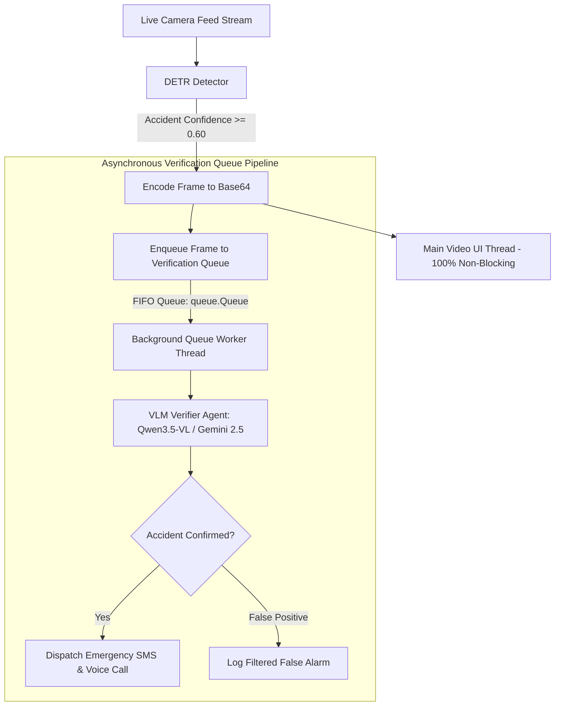

# Implementation Plan: Asynchronous Verification Queue System (Replacing Cooldown)

## 1. Executive Summary

This plan details the replacement of the alert cooldown suppression system with an **Asynchronous Thread-Safe Verification Queue (`queue.Queue`)**. 

When DETR detects a traffic accident with a confidence score $\ge 0.60$, candidate frames are immediately enqueued into a FIFO verification queue. A dedicated background worker thread processes queued frames sequentially through the VLM verifier (**Qwen / Gemini**) to ensure **zero detected incident frames are missed or dropped**.

---

## 2. System Architecture

### Key Improvements:
1. **Zero Missed Incident Scenes**: Cooldown timer suppression is completely removed. Every frame meeting the DETR threshold ($\ge 0.60$) is queued and verified.
2. **Smooth Non-Blocking UI**: The main rendering thread simply pushes lightweight job items to the queue (`enqueue_verification_job`), maintaining full FPS video playback without freezing.
3. **Sequential LLM Processing**: The background worker thread processes items sequentially, preventing API rate limits or Ollama memory overload.

---

## 3. Step-by-Step Implementation

### Step 1: `ui/utils.py` Verification Queue Engine
Add thread-safe queue and worker thread logic:
- `_verification_queue = queue.Queue()`
- `init_verification_worker()`
- `enqueue_verification_job(job_data)`
- `_verification_worker_loop()` -> Drains queue and calls `trigger_agent_dispatch(...)`

### Step 2: `ui/main.py` Logic & UI Cleanups
- Call `init_verification_worker()` at application startup.
- Remove `dispatch_cooldown_minutes` slider and `last_agent_alert_times` checks.
- Inside live detection loop:
  - When accident DETR score $\ge \text{Confidence Threshold}$ (e.g. 0.60):
    - Encode frame snapshot to base64.
    - Call `enqueue_verification_job(...)`.
    - Log console entry: `QUEUED FOR VLM VERIFICATION...`
- Replace deprecated Streamlit `use_container_width=True` calls with `width='stretch'` / `use_container_width=True` clean syntax.

---

## 4. User Confirmation

Please review this plan. Upon your confirmation, we will proceed with implementing these changes.
